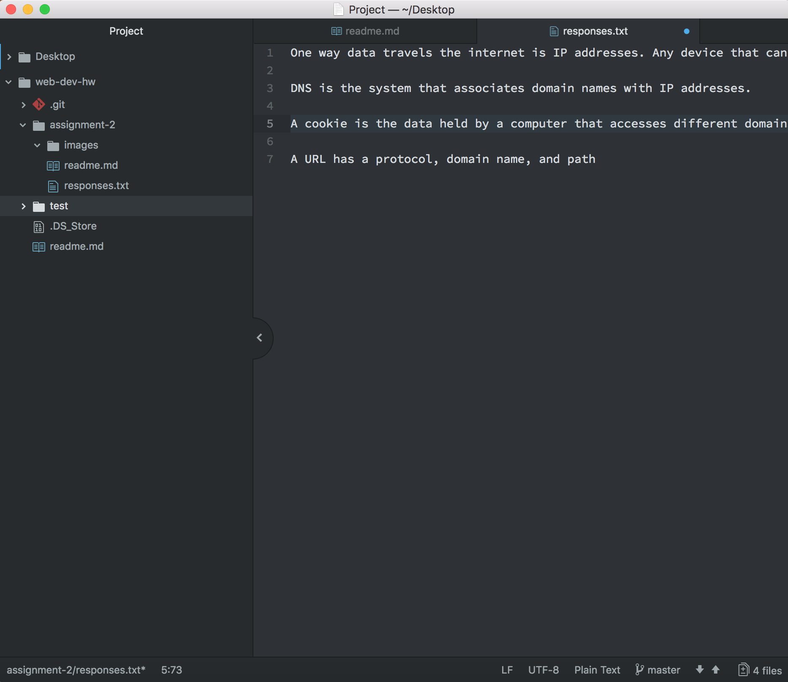

# Assignment 2

Version control system allows a user to keep track of changes over time. We are using GitHub because it is the simplest and allows open source code.

[My responses](./responses.txt)

I think my issue in this work cycle is not knowing or not if the projects are appearing as they should be once I publish it on Github. I will look into this.

