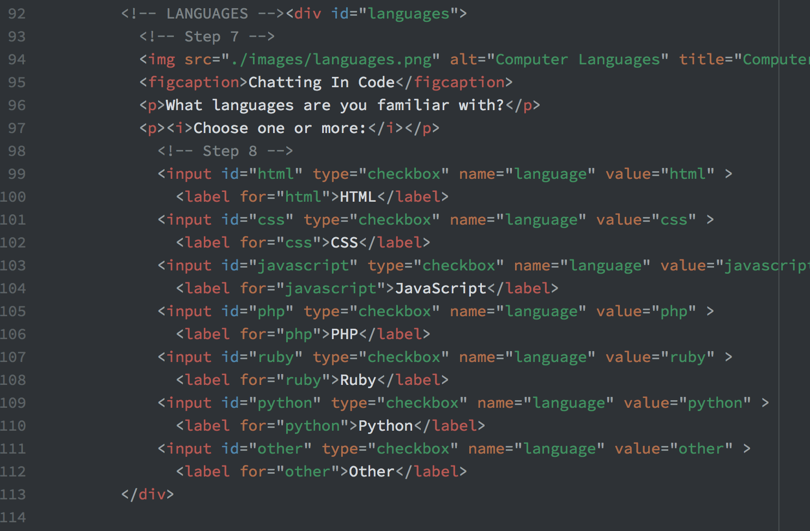

#Assignment 4 Technical Report

Alt text is used for accesibility, describing images to those using screen readers.

Surveys are a common form I see. It is used to collect data and information about people.

This work cycle was very enjoyable. The code for the different type of inputs was overwhelming at first but the repetitiveness helped cement it.

 
